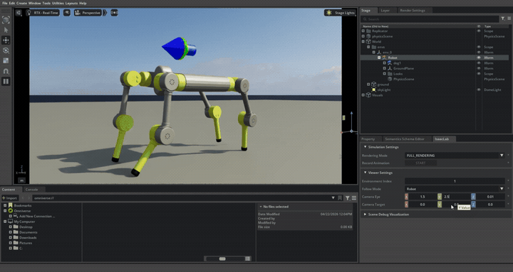

# Merkoval Quadruped — RL Locomotion in NVIDIA Isaac Lab

A reinforcement learning–based locomotion controller for a custom 64.36 kg quadruped robot, developed as part of an MSc Robotics and Automation dissertation at the University of Salford. The policy is trained from scratch in NVIDIA Isaac Lab using Proximal Policy Optimization (PPO) under strict hardware constraints and comprehensive domain randomization, targeting inspection tasks in hazardous environments such as nuclear decommissioning sites.



*Trained PPO policy executing a 0.6 m/s forward trot under active domain randomization.*

---

## Highlights

- **Custom hardware platform.** First operational control framework for an unproven 64.36 kg chassis — no commercial reference platform (Unitree, ANYmal, etc.) reused.
- **End-to-end digital twin pipeline.** CAD → URDF → USD → physics-compliant Isaac Lab asset, with hardware-aligned actuator limits (229 Nm continuous torque, 3.27 rad/s velocity ceiling) enforced as immutable constraints.
- **Sim-to-real–aware training.** Domain randomization across friction (0.3–1.25), payload mass (−5 to +15 kg), CoM displacement (±5 cm), actuator gains (±15%), joint friction (±25%), sensor noise, and 1.5 m/s push perturbations.
- **Deployable artifact.** Trained policy exported to ONNX (`policy/policy.onnx`) for hardware integration outside the Isaac Lab toolchain.

---

## Demonstrations

| Successful recovery | Capsizing failure |
|---|---|
| [](https://www.youtube.com/watch?v=EJa1seMxs6U) | [](https://www.youtube.com/watch?v=bH8MggHYVdg) |
| *Dynamic recovery from a 1.5 m/s lateral impulse — policy re-establishes target velocity within ≈0.5 s.* | *Same perturbation, different gait phase — terminal capsizing. Recovery is dependent on the gait-cycle phase at impact.* |

The full baseline trot is also available on YouTube: [Robot general walk](https://www.youtube.com/watch?v=ZQJIEDR2bz8).

---

## Repository structure

```
merkoval-quadruped/
├── assets/              # GIFs and figures for the README
├── dissertation/        # Full MSc dissertation (PDF)
├── robot/               # URDF, USD, meshes, ROS package scaffolding
├── policy/              # Final policy (PyTorch + ONNX) and resolved training run configs
└── isaaclab_task/       # Isaac Lab task package (environments, agents, scripts)
```

### `robot/`
Self-contained robot description, usable in Isaac Lab, Gazebo, RViz, MuJoCo, or any URDF-aware tool. Includes the SolidWorks-exported URDF, the full set of STL meshes, the per-link inventory CSV (raw SolidWorks export — final simulated values are overridden in Isaac Lab to match dissertation Table 1), and a catkin-ready ROS package scaffold.

### `policy/`
- `model_1499.pt` — final checkpoint at 1500 PPO iterations.
- `policy.pt` / `policy.onnx` — deployable policies (PyTorch and ONNX runtimes).
- `agent.yaml` / `env.yaml` — resolved RSL-RL configs at training time (provenance only; not loaded at inference).

### `isaaclab_task/`
Drop-in Isaac Lab task package providing two registered environments (`Merkoval-Flat-v0`, `Merkoval-Rough-v0`), the PPO runner configuration, and telemetry/plotting scripts used to generate the dissertation's results figures.

---

## Methodology summary

The control policy is an actor–critic neural network with hidden dimensions `[512, 256, 128]` and ELU activations, trained using RSL-RL's PPO implementation (1500 iterations, 24 steps per environment, 4096 parallel environments). The action space is 12-dimensional joint position targets, tracked by per-joint PD controllers (Kp = 800, Kd = 50, nominally; both scaled ±15 % during randomization). The observation vector is 235-dimensional, comprising base linear/angular velocity, projected gravity, velocity commands, joint positions and velocities, previous actions, and a 187-point local terrain height scan.

The reward economy prioritises forward velocity tracking and gait articulation while heavily regularising actuator torque, action rate, undesired contacts, vertical bouncing, chassis orientation, and a custom hip-roll constraint introduced to suppress an emergent asymmetric "sidewinding" failure mode observed during early training.

Full details, derivations, and quantitative analysis are in [`dissertation/Report.pdf`](dissertation/Report.pdf).

---

## Acknowledgements

Supervised by **Dr. Saber Mahboubi Heydarabad**, University of Salford. Built on the [NVIDIA Isaac Lab](https://isaac-sim.github.io/IsaacLab/) framework and the [RSL-RL](https://github.com/leggedrobotics/rsl_rl) library.

## License

MIT — see [`LICENSE`](LICENSE).

## Citation

```bibtex
@mastersthesis{bakun2026merkoval,
  author  = {Bakun, Stephan},
  title   = {Digital Twin Development and Reinforcement Learning for Robust Quadruped Locomotion in NVIDIA Isaac Lab},
  school  = {University of Salford},
  year    = {2026},
  month   = {April}
}
```
